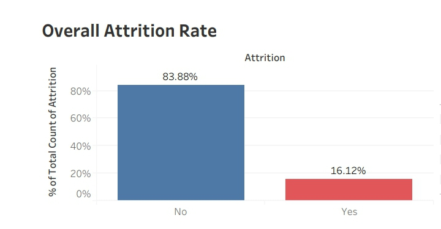
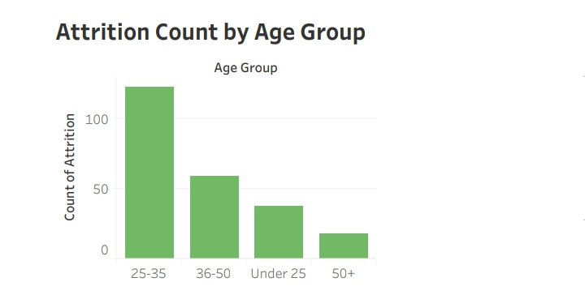
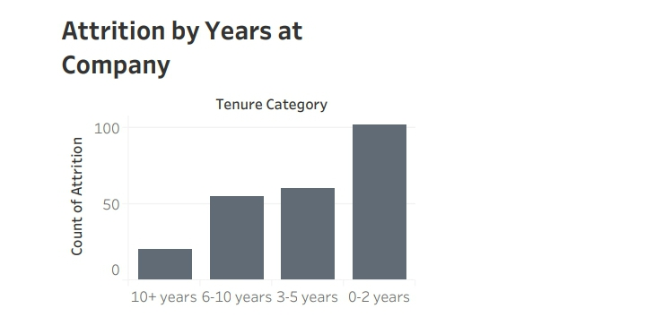
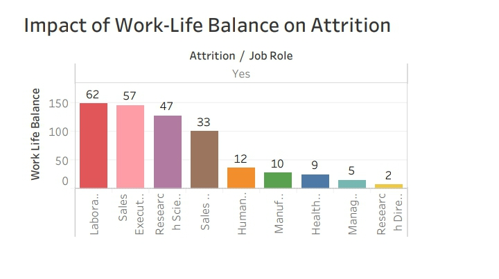
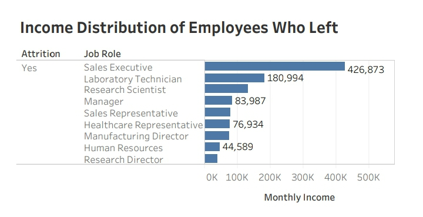
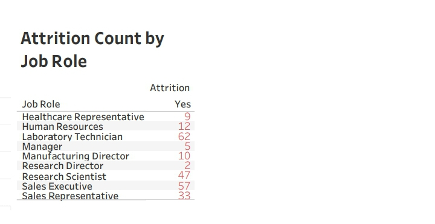

# 🧑‍💼 HR Attrition Analysis  
### By: Ade (ade-data-analytics)

---

## 📌 Project Overview  
This project analyzes employee attrition using the IBM HR Analytics dataset.  
The goal is to understand **why employees leave**, identify contributing factors, and provide actionable insights to support HR decision-making.

The analysis focuses on:  
- Attrition by age  
- Attrition by tenure (years at company)  
- Attrition by job role  
- Work-life balance impact  
- Income differences among employees who left

This is one of the most common real-world HR analytics problems and is widely used in data analyst interviews.

---

## 🛠 Tools Used  
- **R** (tidyverse, dplyr, lubridate) — data cleaning & preparation  
- **Tableau** — dashboard & visualization  
- **CSV** — dataset format  
- **GitHub** — version control & portfolio presentation  

---

## 📂 Dataset Information  
- **Source:** IBM HR Analytics Employee Attrition Dataset  
- **Rows:** 1,470 employees  
- **Columns:** 35 employee attributes  
- **Target variable:** `Attrition` (Yes / No)

---

## 🧹 Data Cleaning & Preparation (R)  
Key cleaning steps performed:

1. Converted `Attrition` into a binary variable (`AttritionFlag`)  
2. Converted character variables into factors  
3. Created **AgeGroup** and **TenureCategory** for better segmentation  
4. Checked and confirmed no missing values  
5. Exported cleaned dataset for Tableau

Cleaned dataset:  
`cleaned_hr.csv`

---

# 📸 Dashboard Visuals

  
   <em>Overall Attrition Rate</em>

  
   <em>Attrition by Age Group</em>

  
   <em>Attrition by Years at Company</em>

  
   <em>Work-Life Balance Impact on Attrition</em>

  
   <em>Income Distribution of Employees Who Left</em>

  
   <em>Attrition Count by Job Role</em>

---

# 📊 Key Insights

### **1️⃣ Overall Attrition Rate**
- **16.12%** of employees left the company.  
- Approximately **1 in 6 employees** resigned.

### **2️⃣ Age Group with Highest Attrition**
- Employees aged **25–35** show the highest attrition.  
- Older employees (50+) rarely leave.

### **3️⃣ Tenure Impact**
- Most attrition occurs within **0–2 years** at the company.  
- Indicates onboarding, role fit, or early burnout issues.

### **4️⃣ High-Risk Job Roles**
- Laboratory Technicians, Sales Executives, and Research Scientists show the highest attrition.  

### **5️⃣ Work-Life Balance Influence**
- Employees with **lower work-life balance** leave more frequently.  
- Suggests workload and stress are major drivers.

### **6️⃣ Income Distribution**
- Many employees who left fall within **lower to mid income** ranges.  
- Salary alone isn't the only reason — but it contributes.

---

# 💡 Business Recommendations

### ✔ Strengthen Onboarding & Early Support  
Most attrition happens in 0–2 years.  
Introduce:  
- structured onboarding  
- mentorship  
- first-90-day check-ins  
- clearer role expectations  

### ✔ Target Retention Programs to Ages 25–35  
Provide:  
- career development  
- flexible work options  
- learning budgets  

### ✔ Improve Work-Life Balance Policies  
- Reduce overtime  
- Promote hybrid/flexible schedules  
- Introduce wellness initiatives  

### ✔ Reassess High-Stress Roles  
Especially in Sales and Research.  
- Adjust KPIs  
- Provide additional training  
- Offer performance incentives  

### ✔ Review Pay Competitiveness  
Low-income roles experience higher churn.  
Re-evaluate compensation bands and bonuses.

---

## 📁 Folder Structure  

