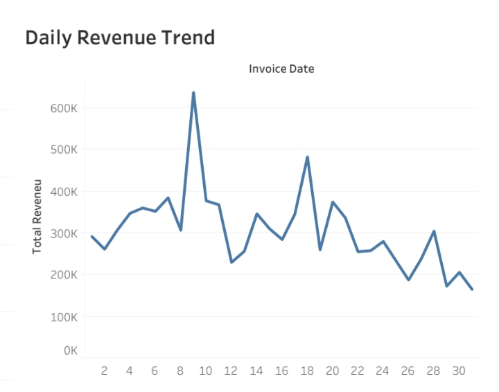

# 🛒 Retail Sales Analysis  
### By: Ade (ade-data-analytics)

---

## 📌 Project Overview  
This project analyzes **online retail transactions** to uncover trends in customer behavior, product performance, and revenue patterns.  
The goal is to help business stakeholders understand:

- When customers buy the most  
- Which products drive the highest revenue  
- What time of day sales peak  
- Which customer segments generate the most value  

This is a classic end-to-end analytics project covering **data cleaning, aggregation, visualization, and business insights**.

---

## 🛠 Tools Used  
- **R** — data cleaning & preprocessing  
- **Tableau** — visualization & dashboard creation  
- **CSV files** — intermediate summary tables  
- **GitHub** — project documentation  

---

## 📂 Dataset Information  
The full retail dataset was very large and could not be uploaded to GitHub.  
Instead, the following **processed summary tables** used for the dashboard were uploaded:

- `daily_revenue.csv`  
- `weekday_revenue.csv`  
- `hourly_revenue.csv`  
- `top_products.csv`  
- `customer_spending.csv`

These tables contain all aggregated metrics needed to reproduce the dashboard.

---

## 🧹 Data Preparation Summary  
Performed in **R**:

1. Removed missing values and invalid transactions  
2. Converted invoice dates to proper datetime format  
3. Calculated total revenue per transaction  
4. Aggregated summary tables:
   - Daily revenue trend  
   - Revenue by weekday  
   - Revenue by hour  
   - Top 10 products by revenue  
   - Customer spending categories  
5. Exported summary datasets for Tableau

---

# 📸 Dashboard Visuals  

  
   <em>Daily Revenue Trend</em>

  
   <em>Revenue by Day of the Week</em>

  
   <em>Revenue by Hour of the Day</em>

  
   <em>Top 10 Products by Revenue</em>

  
   <em>Customer Spending Segments</em>

---

# 📊 Key Insights

### **1️⃣ Daily Sales Behavior**
- Sales fluctuate significantly across the month.
- Multiple revenue spikes show days with exceptionally high purchasing activity.
- Drop-offs indicate potential low-activity periods or stockout effects.

---

### **2️⃣ Revenue by Day of the Week**
- **Thursday** generates the highest revenue.
- **Monday** has the lowest sales activity.
- Mid-week tends to outperform weekends, suggesting strong weekday shopping behavior.

---

### **3️⃣ Revenue by Hour of the Day**
- Peak sales occur between **9 AM – 12 PM**.
- Revenue sharply declines after **4 PM**.
- Morning hours are the most active — potential email campaign window.

---

### **4️⃣ Top Products**
- One product dominates revenue significantly compared to others.
- Popular items include:
  - REGENCY CAKESTAND  
  - POSTAGE  
  - PARTY BUNTING  
  - RABBIT NIGHT LIGHT
- High-performing products can be targeted for promotions.

---

### **5️⃣ Customer Spending Segmentation**
- **Medium-value customers** form the largest segment.
- **Low-value customers** come next.
- **High-value customers** represent the smallest but most profitable segment.

---

# 💡 Business Recommendations

### ✔ 1. Run Promotions on High-Activity Days  
Since Thursday performs best, schedule campaigns or product launches on this day.

### ✔ 2. Target Customers During Morning Hours  
Send promotional emails between **8 AM and 10 AM** (peak buying window).

### ✔ 3. Boost Underperforming Products  
Offer bundles or discounts for low-selling products.

### ✔ 4. Implement Customer Loyalty Programs  
Reward high-value customers and convert medium-value customers into top spenders.

### ✔ 5. Stock More of High-Demand Items  
Top 10 products should be monitored for inventory shortages.

---

## 📁 Folder Structure  
Retail-Sales-Analysis/
│
├── README.md
├── Retail_Dashboard.pdf
├── daily_revenue.csv
├── weekday_revenue.csv
├── hourly_revenue.csv
├── top_products.csv
├── customer_spending.csv
└── screenshots/
├── daily_revenue_trend.png
├── revenue_by_weekday.png
├── revenue_by_hour.png
├── top_products.png
└── customer_spending.png

yaml
Copy code

---

## 📝 How to Reproduce  
1. Load raw retail data into R  
2. Clean and preprocess transactions  
3. Generate summary tables  
4. Load summary tables into Tableau  
5. Rebuild dashboard using the included visuals  

---

## 🎯 Conclusion  
This retail analysis highlights clear sales patterns across days, hours, products, and customer groups.  
The findings support better inventory planning, targeted marketing, and customer engagement strategies.

This project demonstrates skills in **data cleaning, aggregation, visualization, and business communication** — key competencies for data analysts.

---
